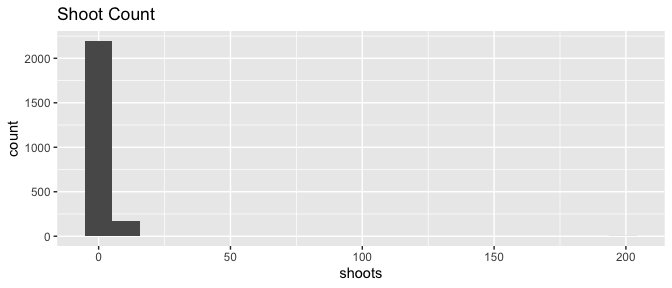

# GitHub Actions For Scientific Data Workflows

<!-- README.md is generated from README.qmd.  Do not edit README.md, edit README.qmd instead! -->

<!-- badges: start -->

<!-- badges: end -->

This repository contains some example uses of GitHub Actions for
automating scientific data workflows. It is inspired heavily by [a
workshop](https://githubactionstutorial-usrse24.readthedocs.io/en/latest/intro.html)
given at US-RSE 2024 by [@valentina-s](https://github.com/valentina-s),
[@gbrencher](https://github.com/gbrencher), and
[@scottyhq](https://github.com/scottyhq). Their book and repository
contain additional examples that are more python focused and maybe more
advanced, while the examples in this repository are more R focused and
will be used in a shorter format
[workshop](https://datascience.cct.arizona.edu/events/automating-research-data-workflows-github-actions)
at the University of Arizona.

## Using this repository

This is a template repository, so you can make a copy of it by clicking
the green “use this template” button.

Once you’ve successfully created a repository in your own GitHub
username or organization, you can navigate to the “Actions” tab where
you’ll find workflows numbered roughly in order of complexity. The .yaml
files defining the workflows have them all set to be triggered on
`workflow_dispatch` so you can run them by selecting a workflow and
clicking the “Run workflow” button.

The .yaml files defining the workflows are in `.github/workflows`. R
code run by some of these workflows is in the `R/` folder. Reports
rendered by some of the actions include the source for this document,
`README.qmd` , and `docs/report.qmd`.

## Example data

The example data in `data/heliconia_sample.csv` is modified from Bruna
et al. (2023). Data validation was run on this dataset using GitHub
Actions in this repo: <https://github.com/BrunaLab/HeliconiaSurveys>.

### References

Bruna, Emilio M., María Uriarte, Maria Rosa Darrigo, Paulo Rubim,
Cristiane F. Jurinitz, Eric R. Scott, Osmaildo Ferreira da Silva, and
John W. Kress. 2023. “Demography of the Understory Herb *Heliconia
Acuminata* (Heliconiaceae) in an Experimentally Fragmented Tropical
Landscape.” *Ecology* 104 (12). <https://doi.org/10.1002/ecy.4174>.

------------------------------------------------------------------------

## Report

One example workflow involves re-rendering this README to include some
updated histograms of the example dataset in `data/heliconia_sample.csv`

